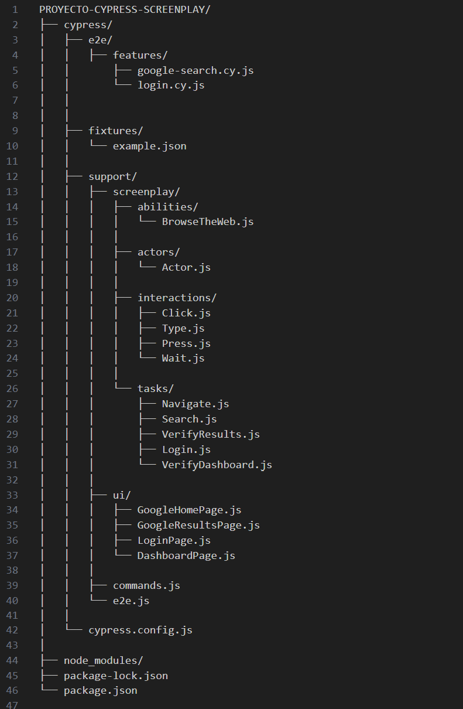

# Screenplay Web - Cypress

## Automatización Screenplay Web

En la rama principal encontrarás el Login Orange Demo y búsqueda en Google. El objetivo de este ejemplo es ver una implementacion del patrón un poco más compleja y robusta con todos los elementos del ScreenPlay.

## Configuración luego de clonar el proyecto y Ejecución por Terminal

Luego de clonar el proyecto, puedes ejecutar los siguientes comandos por CMD en la ruta donde se ha guardado o abrirlo en tu IDE de preferencia para luego ejecutar los comandos y que el proyecto descargue los paquetes e información necesaria para su correcta ejecución.

Instalar Cypress para que se descarguen todos los archivos necesarios para su ejecución.
```sh
npm init -y 
```
Instalar **npx** para ejecutar comandos por consola mucho mas fácil. 

```sh
npm install -g npx
```

Confirma que todo esta funcionando correctamente lanzando el siguiente comando.
```sh
npx cypress open
```


Seleccionas el navegador donde quiera correr tus pruebas.


## La estrucutura del proyecto sería:



** Puesde ir a ../files y ver el archivo .txt si quieres otra vista de la estructura.

Espero poder ayudarte a estrucutrar de otra forma tu proyecto cypress con screemplay. 

Muchas gracias.

***QA Automation - Luis Farco Oviedo***